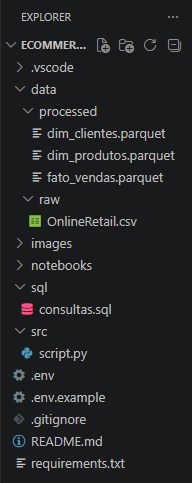
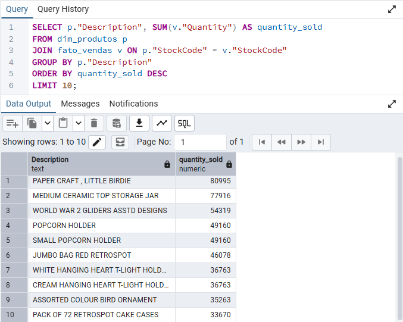
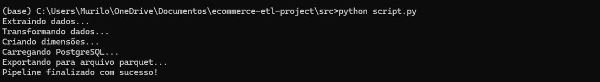

# E-commerce ETL Pipeline

Pipeline ETL desenvolvido em Python para processar dados de vendas de um e-commerce.

O projeto realiza a extração, limpeza, transformação, modelagem dimensional e carga dos dados em um banco PostgreSQL, além de exportar as tabelas finais para o formato Parquet.

---

## Objetivo

O objetivo deste projeto é simular um pipeline de Engenharia de Dados utilizando ferramentas amplamente utilizadas no mercado.

Durante o pipeline são realizadas:

- Extração dos dados
- Limpeza dos dados
- Aplicação de regras de negócio
- Modelagem dimensional
- Exportação para Parquet
- Carga no PostgreSQL
- Consultas SQL para análise dos dados

---

## Regras de negócio

Durante a transformação dos dados foram aplicadas as seguintes regras:

- Remoção de registros duplicados
- Remoção de registros com valores nulos
- Remoção de pedidos cancelados
- Remoção de produtos com preço menor ou igual a zero
- Criação da coluna Revenue
- Separação da data em:
  - Ano
  - Mês
  - Dia
  - Hora

---

## Estrutura do projeto

ecommerce-etl-project/

data/
    raw/
    processed/

notebooks/

sql/

src/

README.md
requirements.txt



---

## Modelagem dos dados

O projeto utiliza um modelo dimensional composto por:

### dim_clientes

- CustomerID
- Country

### dim_produtos

- StockCode
- Description

### fato_vendas

- InvoiceNo
- CustomerID
- StockCode
- Quantity
- Revenue
- Year
- Month
- Day
- Hour

---

## Consultas SQL

O projeto responde perguntas como:

- Faturamento total
- Top 10 produtos mais vendidos
- Top 10 clientes por faturamento
- Faturamento por país
- Faturamento por mês
- Ticket médio dos pedidos
- Valor médio por item vendido
- Quantidade de clientes únicos
- Quantidade total de produtos vendidos

As consultas estão disponíveis em:

```
sql/consultas.sql
```



---

## Como executar

### 1. Clone o repositório

```bash
git clone https://github.com/SEU_USUARIO/ecommerce-etl-project.git
```

### 2. Instale as dependências

```bash
pip install -r requirements.txt
```

### 3. Configure o banco PostgreSQL

Crie um banco chamado:

```
ecommerce_dw
```

### 4. Configure o arquivo .env

```
DB_USER=postgres
DB_PASSWORD=sua_senha
DB_HOST=localhost
DB_PORT=5432
DB_NAME=ecommerce_dw
```

### 5. Execute o pipeline

```bash
python src/script.py
```



---

## Resultados

Após a execução do pipeline são gerados:

- 3 tabelas no PostgreSQL
- 3 arquivos Parquet
- Consultas SQL para análise dos dados

---


## Dataset

Online Retail Dataset

Fonte:

https://archive.ics.uci.edu/dataset/352/online+retail

---

Durante esse projeto foi praticado:

- Desenvolvimento de pipelines ETL em Python
- Limpeza e transformação de dados com Pandas
- Modelagem dimensional
- Manipulação de arquivos Parquet
- Integração com PostgreSQL utilizando SQLAlchemy
- Escrita de consultas SQL para análise dos dados
- Organização de projetos em Engenharia de Dados

## Autor

Murilo Henrique Nellis